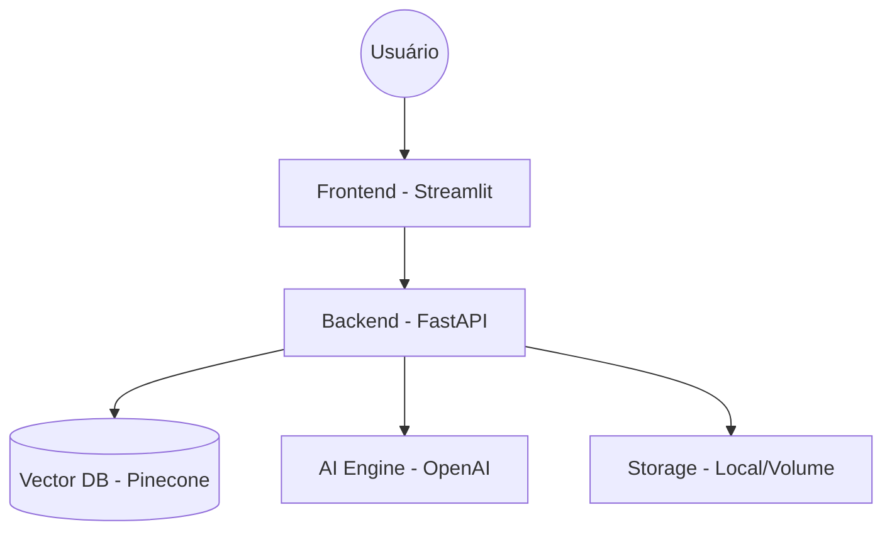
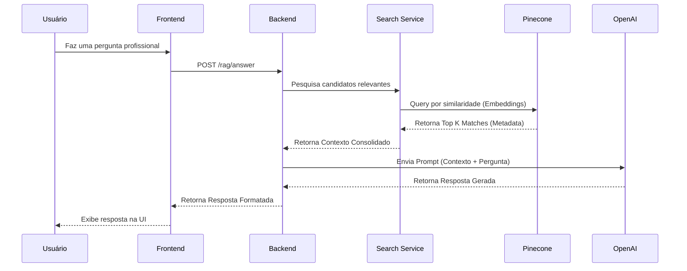
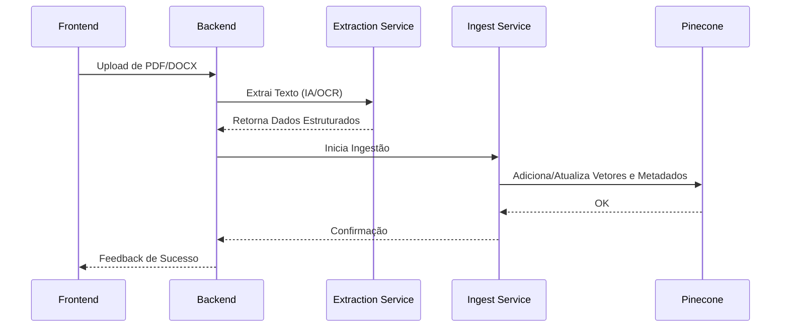

# Arquitetura do Sistema - HR Tech AI Platform

Este documento descreve a arquitetura técnica, os componentes principais e os fluxos de dados da plataforma HR Tech AI.

## 🏗️ Visão Geral

A plataforma segue uma arquitetura cliente-servidor moderna, separando a interface do usuário (Frontend) da lógica de negócios e processamento de IA (Backend).

## 🧩 Componentes Principais

### 1. Frontend (Streamlit)
- Localizado em `ui/`.
- Responsável pela renderização da interface, captura de inputs do usuário e exibição de resultados.
- Comunica-se com o backend via `ui/api_client.py`.

### 2. Backend (FastAPI)
- Localizado em `app/`.
- **API Layer**: Define os endpoints REST (`app/api/routers/`).
- **Core Layer**: Configurações, exceções, middleware e logs (`app/core/`).
- **Service Layer**: Lógica de negócio e orquestração (`app/services/`).

### 3. Vetorização & Busca (Pinecone)
- Armazena as representações vetoriais (embeddings) dos currículos.
- Permite a busca por similaridade semântica.

### 4. Orquestração de IA (LangChain & OpenAI)
- Orquestra chamadas LLM para extração de dados e geração de respostas (RAG).

## 🔄 Fluxos de Dados

### Fluxo de RAG (Busca e Resposta)

### Fluxo de Ingestão de Documentos

## 🛡️ Padrões de Design & Resiliência

- **AI Resilience**: Implementação de retries automáticos com backoff exponencial para chamadas de API externas via `BaseAIService`.
- **Singleton Services**: Instâncias globais de serviços para persistência de estado e eficiência de recursos.
- **Structured Logging**: Uso de `structlog` para rastreabilidade de requisições e diagnósticos precisos.
- **Middleware**: Interceptação de requisições para logs de performance (Middleware de Logging).

## 🗄️ Gerenciamento de Dados

- **Documentos**: Localizados temporariamente em `data/` para processamento.
- **Metadados**: Persistidos no Pinecone junto aos vetores para facilitar a filtragem durante a busca.
